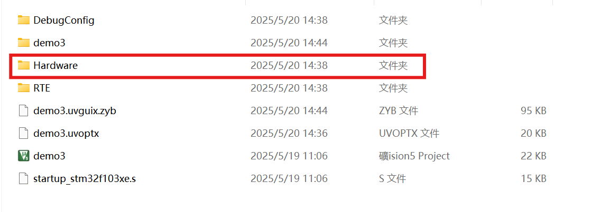
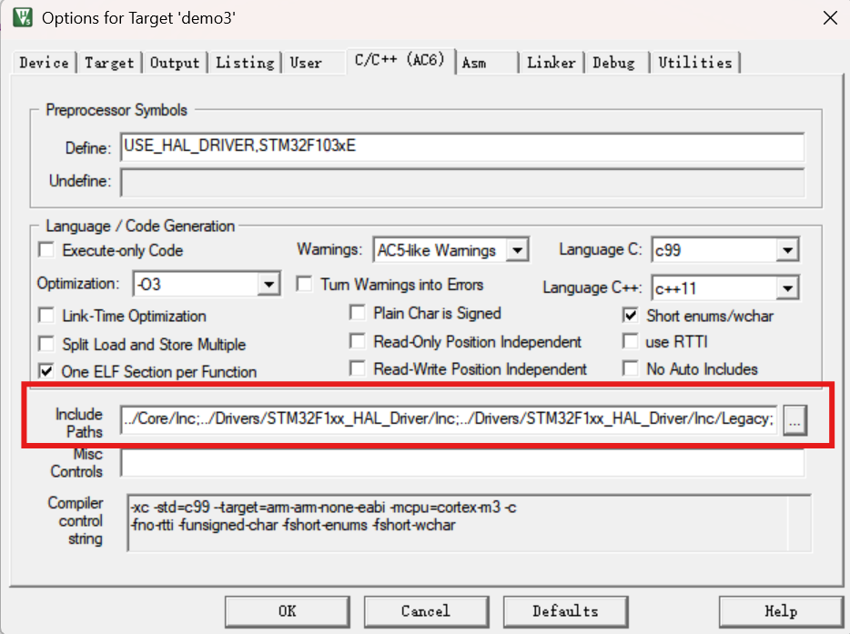
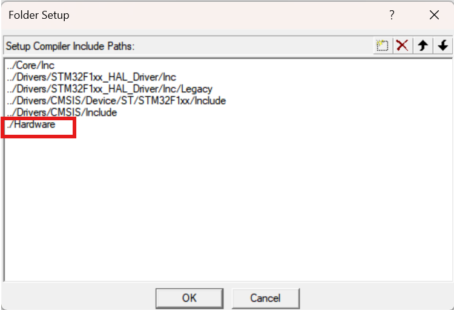
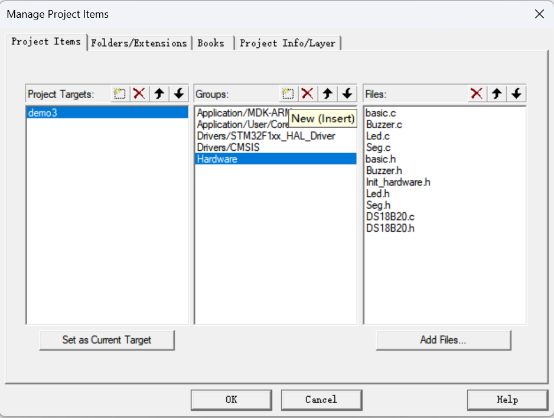
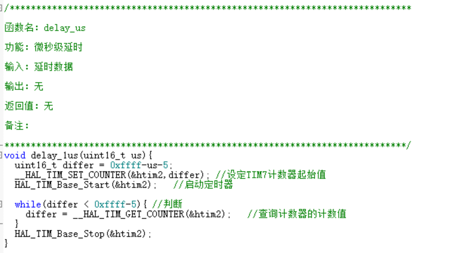
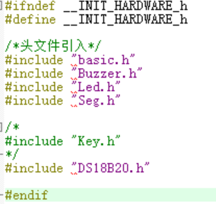

# swjtu-embedded
>本仓库存储了西南交通大学嵌入式实验的实验资料，本人是2022级计算机科学与技术专业的学生，在学习STM32之前已经完整学习过51单片机，之前也接触过STM32（标准库），当然标准库与HAL库本质并无区别，并且HAL库相对来说更加方便也是未来的方向（STM32CUBEMX太方便了）。发布这个仓库的初衷就是希望可以记录自己做实验的过程以及遇到的问题。
>
>推荐的串口助手：[波特律动](https://serial.baud-dance.com/)
>
>学习视频：[BLIBLI keysking](https://space.bilibili.com/6100925)
>
>
## 目录
| 实验名 | 工程名 | 完成情况 |
|-------|-------|-------|
| 实验5 | test5 | 已完成+通过助教检验 |
| 实验6 | test6 | 已完成+通过助教检验 |
| 实验7 | test7 | 已完成+通过助教检验 |

## 比较重要的操作：
* 如何引入外部库：
    1. 复制Hardware到此文件中（不需要担心cubemx在重建的时候会抹掉这个文件） 
    2. 点击魔术棒
    3. 选择路径
    4. 添加外部路径即可
    5. 选择工程组件
    6. 新建Hardware文件夹并且添加需要的程序，先点击`groups`中添加Hardware文件夹，然后再在Hardware中添加文件即可
## 实验6：
| 文件名 | 工程名 | 备注 |
|-------|-------|-------|
| demo1 | 实验内容1 | 已完成+通过助教检验 |
| demo2 | 实验内容2 | 已完成+通过助教检验 |
| demo3 | 实验内容3 | 已完成+通过助教检验 |
| demo4 | 实验内容4 | 已完成+通过助教检验 |
* demo2:主程序while(1)中注释部分为实现呼吸灯部分，可注释while(1)其他部分（即更改亮度）。
* demo3/demo4:实验内容3以及实验内容4（即数码管显示以及串口返回）已结合在demo4中。

## 实验7
>注意：
>demo1:连续转换模式->关闭
>demo1:连续转换模式->开启

| 文件名 | 工程名 | 备注 |
|-------|-------|-------|
| demo1 | 实验内容1 | 已完成+通过助教检验 |
| demo2 | 实验内容2 | 已完成+通过助教检验 |
| demo3 | 实验内容3 | 已完成+通过助教检验 |
| demo4 | 实验内容4 | 已完成+通过助教检验 |

①demo1:通过轮询方式进行ADC转换
* uint16_t value:读取12位ADC转换值 必须使用16位来进行读取，否则会出现读取不完全的情况
* `HAL_ADC_Start(&hadc1)`;开启ADC转换（在未开启连续转换模式下开启一次智能读取一个值）
* `HAL_ADC_PollForConversion(&hadc1,HAL_MAX_DELAY)`：等待转换完成
* `HAL_ADC_GetValue(&hadc1)`:返回ADC值
* 建议：`HAL_ADCEx_Calibration_Start(&hadc1)`:校准函数
* 效果图：

②demo2:
* 开启连续转换模式，可以对比一下demo1以及demo2中不同来学习如何使用ADC的基础用法

③demo3:
* 思路：通过定时器进行分配各个操作任务分配
* 模块：ADC（初期可以用电压采集进行模拟）数码管 LED RGB 蜂鸣器 电机
* 1. 定时器设置：TIM1: **Mode** Internal clock  **Configuration** PSC :7200-1  |  ARR: 10-1  **NVIC** update 或者 global 
* 2. 蜂鸣器设置：之前是通过软件延时，我们这次采用PWM输出 
* 注意：需要引入我写好的外部库：Hardware

④demo4:
* 引入DS18B20外部库即可，在主函数中添加`void DS18B20_Start(void)`以及`DS18B20_Get_Temp`即可，具体代码可看仓库
* 外部库已经写入Hardware文件.
* DS18B20外部库的说明：
  1. 定时器设置为1us，我这里选用的是定时器2 ,一般会推荐在TIM.C文件中写这个代码，但是这里为了大家学习方便，我就直接写在外部库这里了。
  2. 修改Init_hardware.h文件，把用不到的注释
